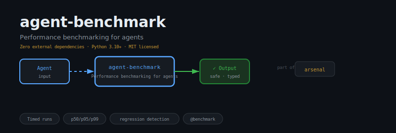
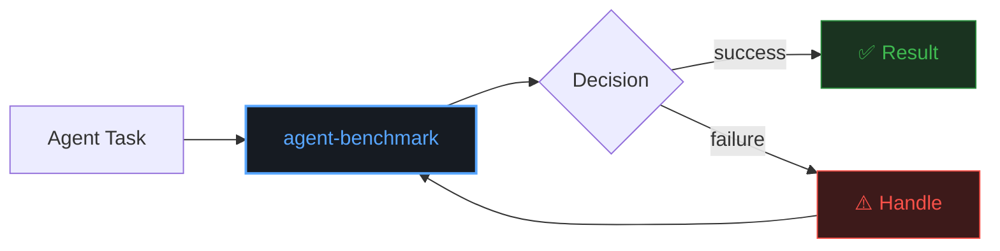
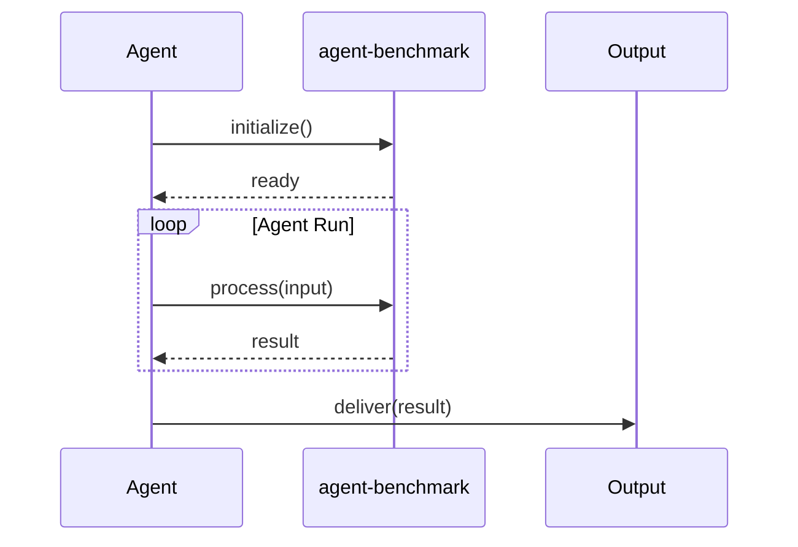

<div align="center">

</div>

# agent-benchmark

**Performance benchmarking for agents for LLM agents. Zero external dependencies.**

[](https://pypi.org/project/agent-benchmark/)
[](https://python.org)
[](LICENSE)
[](pyproject.toml)

---

## The Problem

Production LLM agents fail silently. Without performance benchmarking for agents, you get undefined behaviour at scale — race conditions, lost state, cascading failures, and no way to debug what went wrong.

`agent-benchmark` gives you a production-ready performance benchmarking for agents primitive with a clean API, tested edge cases, and zero configuration.

## Installation

```bash
pip install agent-benchmark
```

Or from source:

```bash
git clone https://github.com/darshjme/agent-benchmark.git
cd agent-benchmark
pip install -e .
```

## Quick Start

```python
from agent_benchmark import *  # see API reference below

# See examples/ directory for complete working examples
```

## API Reference

The main classes and functions are defined in `agent_benchmark/__init__.py`.

Key exports: `Timed runs · p50/p95/p99 · regression detection · @benchmark`

All classes follow a consistent interface:
- Instantiate with sensible defaults
- Compose with other arsenal libraries
- Zero external dependencies required

See the source code and `tests/` directory for verified usage examples.

## How It Works





## Philosophy

The student who measures their progress becomes the master. agent-benchmark is that measurement.

---

## Part of the Arsenal

`agent-benchmark` is one of six production libraries for LLM agents:

| Library | Purpose |
|---------|---------|
| [herald](https://github.com/darshjme/herald) | Semantic task routing |
| [engram](https://github.com/darshjme/engram) | Agent memory |
| [sentinel](https://github.com/darshjme/sentinel) | ReAct loop guards |
| [verdict](https://github.com/darshjme/verdict) | Agent evaluation |
| [agent-guardrails](https://github.com/darshjme/agent-guardrails) | Output validation |
| [agent-observability](https://github.com/darshjme/agent-observability) | Tracing & metrics |

→ [arsenal](https://github.com/darshjme/arsenal) — the complete stack

---

*Built by [Darshankumar Joshi](https://github.com/darshjme), Gujarat, India.*
